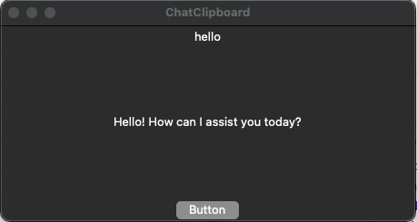
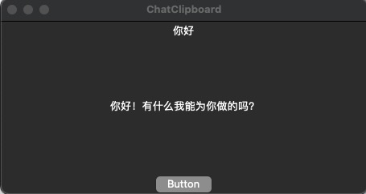

# ChatClipboard

## English Introduction

ChatClipboard is a convenient desktop application designed to allow users to quickly get ChatGPT response results through a few simple steps.

When you need help from ChatGPT, simply copy the text to the clipboard, and then click the button in ChatClipboard to send the clipboard content to ChatGPT. The program will automatically update the clipboard content to the ChatGPT response, and then you can paste the result into the desired application using Ctrl+V.

ChatClipboard is a very practical tool, especially suitable for users who need to frequently interact with ChatGPT. It can greatly improve efficiency and reduce the tedious operation of manual input and copy-paste.

The interface of ChatClipboard is simple and intuitive, and easy to use. In the settings, users can choose their own ChatGPT API key and customize shortcuts to activate ChatClipboard. In addition, ChatClipboard also provides some other customization options, such as customizing the font and color of input and output text.

In conclusion, ChatClipboard is a powerful and easy-to-use desktop application that can greatly improve the efficiency of interaction between users and ChatGPT. It is an indispensable practical tool.

## 中文简介

ChatClipboard 是一个方便的桌面应用程序，旨在通过简单的几个步骤，让用户能够快速获取 ChatGPT 的响应结果。

当你需要寻求 ChatGPT 的帮助时，只需将文本复制到剪贴板中，然后单击 ChatClipboard 中的按钮即可将剪贴板内容发送到 ChatGPT。程序会自动将剪贴板内容更新为 ChatGPT 响应结果，然后你可以通过 ctrl v 将结果粘贴到所需的应用程序中。

ChatClipboard 是一款非常实用的工具，尤其适用于那些需要频繁与 ChatGPT 进行交互的用户。它可以大大提高效率，并减少手动输入和复制粘贴的繁琐操作。

ChatClipboard 的界面简洁直观，易于使用。在设置中，用户可以选择自己的 ChatGPT API 密钥，并自定义快捷键来激活 ChatClipboard。此外，ChatClipboard 还提供了一些其他的自定义选项，例如自定义输入和输出文本的字体和颜色。

总之，ChatClipboard 是一款功能强大、易于使用的桌面应用程序，它能够大大提高用户与 ChatGPT 之间的交互效率，是一款不可多得的实用工具。

## Quick and Easy to Use
With ChatClipboard, getting responses from ChatGPT is a breeze. Here's how to get started:

* First, configure your OpenAI key in the settings.
* Copy any text you want to get a response for using Ctrl+C.
* Click the ChatClipboard button and wait a few seconds.
* The program will automatically update your clipboard with the ChatGPT response.
* Simply paste the result into any application using Ctrl+V.

ChatClipboard is designed to make your interactions with ChatGPT as seamless and efficient as possible. With just a few clicks, you'll have the answer you need.

## 快速易用
使用 ChatClipboard 快速获取 ChatGPT 的响应结果非常简单。以下是快速入门的步骤：

* 首先，在设置中配置你的 OpenAI 密钥。
* 使用 Ctrl+C 复制你想要获得响应结果的任何文本。
* 点击 ChatClipboard 按钮，等待几秒钟。
* 程序会自动更新你的剪贴板，将 ChatGPT 响应结果复制到剪贴板上。
* 最后，通过 Ctrl+V 将结果粘贴到任何应用程序中。

ChatClipboard 旨在使你与 ChatGPT 的交互变得无缝和高效。只需几次点击，你就可以获得所需的答案。

## Website
[https://github.com/fendouai/ChatClipboard](https://github.com/fendouai/ChatClipboard)

## Image

